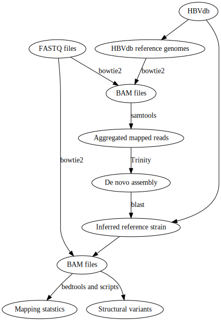

HBVouroboros: A snakemake-based workflow to map RNA-sequencing reads to circular HBV cccDNA
===
Jitao David Zhang, with inputs from Roland Ambs, 11.03.2020

# Background

The ouroboros (or uroboros) is an ancient symbol depicting a serpent or dragon eating its own tail. 

*HBVouroboros* implements a snakemake-based workflow to map Illumina RNA-sequencing reads to HBV cccDNA. *HBVouroboros* offers following functionalities:

* Mapping reads to reference genomes of of eight major HBV genotypes (A-H). 
    * The mapping procedure takes care of reads that span the junctions between the two ends of the linear form of the cccDNA. This holds true also for mapping procedures described later.
* *De novo* assembly of the HBV genome
* Inference of the reference strain from which the reads are likely generated and genotype calling using BLAST and data from HBVdb
* Base-level, gene-level, and HBV-genome-level quantification of read counts, as well as structural variants with regard to the inferred reference strain.

# Usage

# Graphic workflow



# Methods

## HBV reference genomes

We downloaded HBV reference genomes of major genotypes (A-H) from The Hepatitis B Virus Database ([HBVdb](https://hbvdb.lyon.inserm.fr/HBVdb/HBVdbDataset?seqtype=0), release 50, March 2020). HBVdb provides two reference genomes for each of the eight major genotypes, making 16 reference genomes in total. Important information about these reference genomes, including accession number, reference, *etc.*, can be found [in the website of the HBVdb database](https://hbvdb.lyon.inserm.fr/HBVdb/HBVdbNomenclature?nomenclature=table).

## Making aligners work with the circular structure of HBV cccDNA

Most popular sequence aligners that we tested, including bowtie2 and STAR, do not provide specific support for circular genomes. While it is possible to map RNA-sequencing reads derived from HBV cccDNAs to the linear genomes deposited in HBVdb and other public databases, reads that span both ends of the linear genome will not be correctly mapped, causing an inaccurate estimate of HBV gene expression.

We took an approach inspired by the annotation procedure of HBVdb to circumvent this problem[^1]. We duplicated the sequence of each reference genome, concatenated the original and the duplicate genome, and used the concatenated genomes (twice the size of the original genome) as templates of read mapping.

[^1]: https://academic.oup.com/nar/article/41/D1/D566/1051781

## Aligning reads to HBV genomes

Given that concatenated HBV genomes are used as templates, virtually any sequence alignment software can be used for read mapping. Given that HBV genes are transcribed from cccDNA without splicing, RNA sequencing reads can be aligned in an ungapped fashion. *HBVouroboros* uses *STA* as the default aligner. Users can modify the Snakemake workflow to use other aligners if it is necessary, for instance to use the same aligner for mapping reads to both HBV and to the host genome or transcriptome, for instance the human genome.

## *De novo* assembly

We use the software *Trinity* to perform *de novo* assembly of the HBV cccDNA genome. The largest contig generated by *Trinity* is used to search against all HBV genomes available in *HBVdb*. The top BLAST hit is used as the *inferred reference strain* for downstream analysis.


## Nucleotide-level, gene-level, and HBV-genome level summary statistics as well as structural variants

*HBVouroboros* reports read coverage per nucleotide base and per gene of the inferred genotype, as well as single-nucleotide polymorphisms (SNP) compared with the inferred reference genome. 

# Notes for the developer

## Setup the HBVouroboros package

```bash
conda activate HBVouroboros
make install
```

## Build HBV reference genomes (run once at installation)

```bash
HBVouroboros_refdir=/pstore/data/bi/apps/HBVouroboros
HBVouroboros_build_refgenomes.py "${HBVouroboros_refdir}"
```

## Test biokit output directory  

*Not working yet*

```bash
bin/HBVouroboros_map_biokit.py ${HBVouroboros_refdir} ~/projects/2020-01-HBVcccDNA-RNAseq/cccDNA_destab_202002/biokit_outdir_cccDNA_destab_PHH_202002
```
